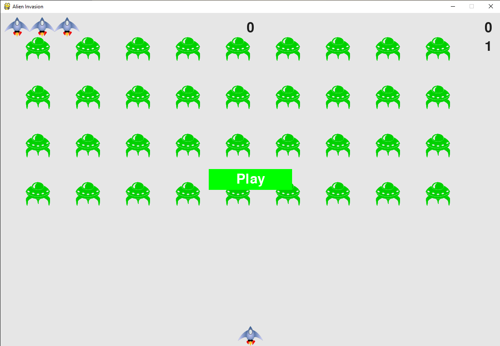

<div align=center margin= auto> 
  
</div>

# 👽 Alien Invasion
Alien invasion is a clone of popular arcade game with same name.
I created this game by following the "Python Crash Course" book. The reason was to improve my python skills.

## 🚀 Introduction
> In Alien Invasion, the player controls a ship that appears at
the bottom center of the screen. The player can move the ship
right and left using the arrow keys and shoot bullets using the
spacebar. When the game begins, a fleet of aliens fills the sky
and moves across and down the screen. The player shoots and
destroys the aliens. If the player shoots all the aliens, a new fleet
appears that moves faster than the previous fleet. If any alien hits
the player’s ship or reaches the bottom of the screen, the player
loses a ship. If the player loses three ships, the game ends.

## 🔧 Requeriments
- [Python](https://www.python.org/) 3.x +
- [Pygame](https://www.pygame.org/)

## :video_game: Controls

- Space-bar
  - Shoot

- Arrows keys (left - right)
  - Move the ship left / right

## ⚔ Let's play

### Cloning the Repository

```
$ git clone https://github.com/bryanlds/Alien-Invasion.git

$ cd Alien-Invasion
```

### Running 

```
$ python alien_invasion.py
``` 

Enjoy!
